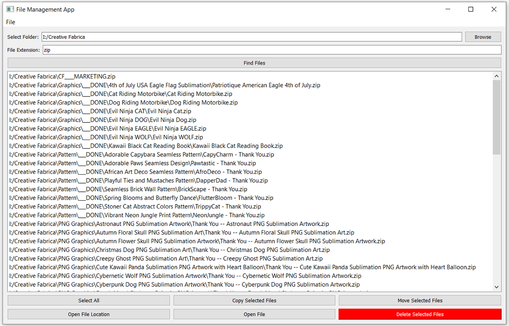

# File Management Tool

## Overview

The File Management Tool is a Python-based application built with PyQt5 for managing files within a specified directory. This tool allows users to search for files by extension, copy, move, delete files, and open files or their containing folders directly from the interface. It is designed to provide an intuitive and efficient way to handle file operations.

## Features

- **Browse Folder**: Select a directory to search for files.
- **Find Files**: Search for files with a specific extension within the selected directory.
- **Select All Files**: Quickly select all listed files.
- **Copy Files**: Copy selected files to a specified destination.
- **Move Files**: Move selected files to a specified destination.
- **Delete Files**: Delete selected files after confirmation.
- **Open File Location**: Open the location of a selected file in the file explorer.
- **Open File**: Open a selected file with the default application.

## Installation

### Prerequisites

- Python 3.x
- PyQt5

### Clone the Repository

```bash
git clone https://github.com/Nafi7393/File-Management-Tool.git
cd File-Management-Tool
```

### Install Dependencies

```bash
pip install -r requirements.txt
```

## Usage

### Running the Application

```bash
python gui.py
```

### Application Interface

1. **Browse Folder**: Click the "Browse" button to select the directory you want to search in.
2. **File Extension**: Enter the file extension (e.g., `txt`, `zip`) in the provided input field.
3. **Find Files**: Click the "Find Files" button to search for files with the specified extension.
4. **File Operations**:
    - **Select All**: Click "Select All" to select all listed files.
    - **Copy Selected Files**: Click "Copy Selected Files" to copy selected files to a destination folder.
    - **Move Selected Files**: Click "Move Selected Files" to move selected files to a destination folder.
    - **Delete Selected Files**: Click "Delete Selected Files" to delete the selected files.
    - **Open File Location**: Click "Open File Location" to open the location of the selected file in the file explorer.
    - **Open File**: Click "Open File" to open the selected file with the default application.

### Screenshots

#### GUI Interface


#### After Searching for ZIP Files


## Project Structure

```
File-Management-Tool/
│
├── main.py               # Core functionality for file operations
├── gui.py                # PyQt5-based GUI implementation
├── README.md             # Project documentation
├── requirements.txt      # Python dependencies
├── DEMO/                 # Directory for images used in README
│   ├── base-gui.png
│   └── on-action.png
└── ...                   # Other project files
```

## Core Functions

### `main.py`

- **`find_files_with_extension(folder, extension)`**:
  Recursively searches for files with a specified extension in a given folder.

- **`delete_file(file_path)`**:
  Deletes a specified file if it exists.

- **`move_or_copy_file(file_path, destination_folder, action='copy')`**:
  Moves or copies a file to a specified destination folder.

- **`open_file_or_folder(file_path, file=True)`**:
  Opens a file or folder using the default application.

- **`rename_file(file_path, new_name)`**:
  Renames a specified file.

### `gui.py`

- **`browse_folder()`**:
  Opens a dialog to select a folder and sets the folder path in the input field.

- **`find_files()`**:
  Finds files matching the specified extension in the selected folder and displays them in the list widget.

- **`select_all_files()`**:
  Selects all items in the list widget.

- **`copy_files()`**:
  Copies selected files to a specified destination folder.

- **`move_files()`**:
  Moves selected files to a specified destination folder.

- **`delete_files()`**:
  Deletes selected files after confirming with the user.

- **`open_file_location()`**:
  Opens the location of the first selected file in the file explorer.

- **`open_file()`**:
  Opens the selected file using the default application.

## Contributing

1. Fork the repository.
2. Create a new branch (`git checkout -b feature-branch`).
3. Commit your changes (`git commit -am 'Add new feature'`).
4. Push to the branch (`git push origin feature-branch`).
5. Create a new Pull Request.


## Acknowledgments

- Thanks to the PyQt5 documentation and various online resources for guidance.
